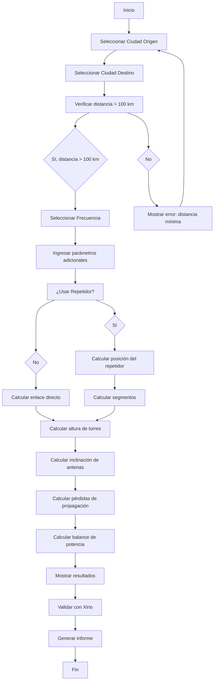

# Arquitectura de la Aplicación: Herramienta de Diseño de Enlaces de Microondas

## 1. Visión General del Proyecto

**Nombre del Proyecto:** MicrowaveLinkDesigner_CO  
**Lenguaje:** Python 3.x  
**Interfaz:** Gráfica de Usuario (GUI) usando Tkinter  
**Propósito:** Herramienta para diseñar enlaces de microondas entre ciudades de Colombia

## 2. Estructura del Proyecto

```
MicrowaveLinkDesigner/
├── main.py                    # Punto de entrada de la aplicación
├── gui/
│   ├── __init__.py
│   ├── main_window.py         # Ventana principal
│   ├── input_panel.py         # Panel de entrada de datos
│   ├── results_panel.py        # Panel de resultados
│   └── visualization_panel.py # Panel de visualización
├── core/
│   ├── __init__.py
│   ├── geography.py           # Cálculos geodésicos
│   ├── link.py                # Clase principal del enlace
│   ├── repeater.py            # Lógica de repetidores
│   └── propagation.py         # Cálculos de propagación
├── data/
│   ├── __init__.py
│   └── colombia_cities.json   # Base de datos de ciudades
├── utils/
│   ├── __init__.py
│   ├── constants.py           # Constantes y configuraciones
│   └── validators.py          # Validadores de entrada
├── reports/
│   ├── __init__.py
│   └── report_generator.py    # Generador de informes
└── docs/
    ├── README.md
    ├── SPEC.md
    └── MANUAL_USUARIO.md
```

## 3. Módulos y Clases Principales

### 3.1 Módulo: core/geography.py

```python
class GeographyCalculator:
    """Clase para cálculos geodésicos y topográficos."""
    
    def haversine_distance(lat1, lon1, lat2, lon2) -> float:
        """Calcula distancia ortodrómica entre dos puntos."""
    
    def calculate_azimuth(lat1, lon1, lat2, lon2) -> float:
        """Calcula azimut desde punto 1 hacia punto 2."""
    
    def calculate_earth_curvature_correction(distance_km) -> float:
        """Calcula corrección por curvatura terrestre."""
    
    def interpolate_terrain(lat1, lon1, lat2, lon2, num_points) -> list:
        """Interpola el terreno entre dos puntos."""
```

### 3.2 Módulo: core/link.py

```python
class MicrowaveLink:
    """Clase principal que representa un enlace de microondas."""
    
    def __init__(self, site_a, site_b, frequency):
        # site_a, site_b: objetos Site
        # frequency: frecuencia en GHz
    
    def calculate_line_of_sight(self) -> dict:
        """Calcula si hay línea de vista directa."""
    
    def calculate_tower_heights(self) -> tuple:
        """Calcula alturas mínimas de las torres."""
    
    def calculate_antenna_tilt(self) -> tuple:
        """Calcula inclinación de las antenas."""
    
    def calculate_fresnel_clearance(self) -> dict:
        """Calcula despejamiento de zona de Fresnel."""
    
    def get_link_summary(self) -> dict:
        """Retorna resumen completo del enlace."""
```

### 3.3 Módulo: core/propagation.py

```python
class PropagationCalculator:
    """Clase para cálculos de propagación."""
    
    def free_space_loss(distance_km, frequency_ghz) -> float:
        """Calcula pérdida en espacio libre (modelo Friis)."""
    
    def rain_attenuation(distance_km, frequency_ghz, latitude) -> float:
        """Calcula atenuación por lluvia (ITU-R P.530)."""
    
    def gas_attenuation(distance_km, frequency_ghz) -> float:
        """Calcula atenuación por gases atmosféricos."""
    
    def total_path_loss(distance_km, frequency_ghz, latitude, availability) -> dict:
        """Calcula pérdida total del enlace."""
    
    def link_power_balance(tx_power_dbm, tx_gain, rx_gain, 
                          path_loss, sensitivity_dbm) -> dict:
        """Calcula balance de potencia y margen del enlace."""
```

### 3.4 Módulo: core/repeater.py

```python
class RepeaterDesigner:
    """Clase para diseño de repetidores."""
    
    def __init__(self, main_link):
        # main_link: objeto MicrowaveLink
    
    def calculate_repeater_position(self, num_repeaters=1) -> list:
        """Calcula posición óptima del repetidor."""
    
    def calculate_segment_heights(self, repeater_position) -> dict:
        """Calcula alturas de torres para cada segmento."""
    
    def optimize_repeater_location(self, constraints) -> dict:
        """Optimiza ubicación del repetidor considerando restricciones."""
    
    def generate_hop_chain(self, min_distance_km) -> list:
        """Genera cadena de saltos para enlaces largos."""
```

### 3.5 Módulo: gui/main_window.py

```python
class MainWindow:
    """Ventana principal de la aplicación."""
    
    def __init__(self, root):
        # Configuración de la ventana principal
        # Creación de paneles
        # Conexión de eventos
    
    def create_menu(self):
        """Crea menú de la aplicación."""
    
    def create_toolbar(self):
        """Crea barra de herramientas."""
    
    def on_calculate_click(self):
        """Manejador del botón calcular."""
    
    def on_validate_xirio_click(self):
        """Manejador para validar con Xirio."""
    
    def on_generate_report_click(self):
        """Manejador para generar informe."""
```

## 4. Diseño de la Interfaz Gráfica

### 4.1 Layout Principal

```
+------------------------------------------------------------------+
|  Menu: Archivo | Editar | Calcular | Herramientas | Ayuda      |
+------------------------------------------------------------------+
|                                                                  |
|  +------------------------+  +--------------------------------+  |
|  |  PANEL DE ENTRADA      |  |  PANEL DE RESULTADOS           |  |
|  |                        |  |                                 |  |
|  |  Ciudad Origen: [▼]   |  |  Distancia: XXX km             |  |
|  |  Ciudad Destino: [▼]   |  |  Azimut: XXX°                  |  |
|  |                        |  |  Altura Torre A: XXX m         |  |
|  |  Frecuencia: [▼] GHz   |  |  Altura Torre B: XXX m         |  |
|  |  Potencia: [  ] dBm    |  |  Inclinación Antena: +/-XX°    |  |
|  |  Ganancia: [  ] dBi    |  |  Zona de Fresnel: XX%          |  |
|  |                        |  |                                 |  |
|  |  [x] Usar Repetidor    |  |  PÉRDIDAS:                     |  |
|  |  Disponibilidad: [▼] % |  |  Espacio Libre: XX dB          |  |
|  |                        |  |  Lluvia: XX dB                 |  |
|  |  [CALCULAR]            |  |  Gases: XX dB                  |  |
|  |                        |  |  TOTAL: XX dB                  |  |
|  +------------------------+  |                                 |  |
|                              |  MARGEN DEL ENLACE: XX dB       |  |
|  +------------------------+  |  [VALIDAR CON XIRIO]            |  |
|  |  VISUALIZACIÓN         |  |  [GENERAR INFORME]             |  |
|  |                        |  +--------------------------------+  |
|  |  [Mapa del perfil]     |                                     |
|  |                        |                                     |
|  +------------------------+                                     |
+------------------------------------------------------------------+
|  Status: Listo                                                  |
+------------------------------------------------------------------+
```

### 4.2 Colores y Estilo

- **Tema:** Oscuro con acentos en azul técnico
- **Colores principales:**
  - Fondo principal: #1E1E2E
  - Fondo de paneles: #2D2D3D
  - Color de acento: #007ACC (azul técnico)
  - Color de éxito: #4EC9B0
  - Color de advertencia: #DCDCAA
  - Color de error: #F14C4C

### 4.3 Fuentes

- **Títulos:** Segoe UI Bold, 14pt
- **Etiquetas:** Segoe UI, 11pt
- **Resultados:** Consolas, 11pt (para valores numéricos)

## 5. Flujo de Ejecución



## 6. Validación con Xirio Online

### 6.1 Integración con Xirio

La herramienta permitirá:
1. Exportar parámetros del enlace en formato compatible
2. Abrir Xirio online en el navegador
3. Comparar resultados manualmente

### 6.2 Parámetros para Validación

- Coordenadas de sitios
- Altura de torres
- Frecuencia de operación
- Distancia del enlace
- Pérdidas calculadas

## 7. Generación de Informes

### 7.1 Formato del Informe

- **Extensión:** PDF
- **Extensión alternativa:** DOCX
- **Extensión alternativa:** HTML
- **Máximo de páginas:** 5

### 7.2 Contenido del Informe

1. **Resumen ejecutivo**
2. **Parámetros del enlace**
3. **Cálculos de ingeniería**
4. **Resultados de propagación**
5. **Diagramas y visualizaciones**

## 8. Dependencias Python

```txt
numpy>=1.21.0
matplotlib>=3.5.0
tkinter>=8.6
reportlab>=4.0.0
geopy>=2.2.0
json (estándar)
math (estándar)
```

## 9. Recomendaciones ITU-R Utilizadas

1. **ITU-R F.1101:** Características de sistemas de transmisión digital
2. **ITU-R P.530:** Métodos de predicción de propagación
3. **ITU-R F.386:** Predicción de propagación por impulsos
4. **ITU-R P.528:** Métodos de predicción para difusión

## 10. Casos de Uso Principales

1. **Diseño de enlace directo:** Entre dos ciudades a más de 100 km
2. **Diseño con repetidor:** Añadir uno o más repetidores intermedios
3. **Validación de resultados:** Comparar con Xirio online
4. **Generación de informes:** Crear documentación técnica

## 11. Pruebas y Validación

### 11.1 Pruebas Unitarias
- Cálculos geodésicos
- Cálculos de propagación
- Cálculos de repetidores

### 11.2 Pruebas de Integración
- Flujo completo de cálculo
- Generación de informes
- Validación con Xirio

### 11.3 Casos de Prueba
1. Bogotá - Bucaramanga (~400 km)
2. Bogotá - Medellín (~420 km)
3. Bogotá - Cali (~450 km)
4. Barranquilla - Cartagena (~250 km)
5. Con repetidor: Bogotá - Quito (enlace internacional simulado)
